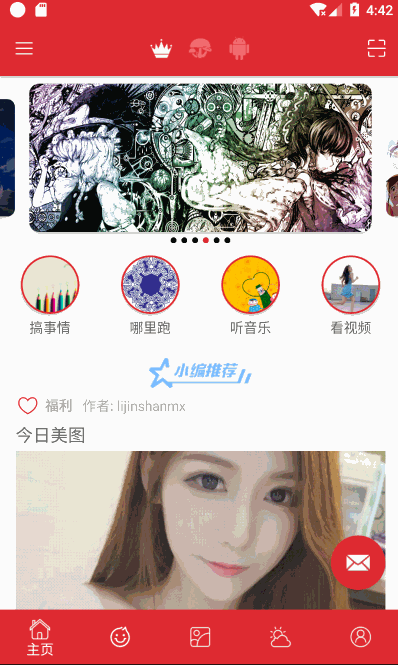

# Android轮播控件

banner View，实现无线轮播功能。自定义transformer 内置了ScalePageTransformer，见效果图，
可以自定义indicator，传入内置了圆形的 QyIndicator ，非常轻量，具体可以观看代码，希望大家觉得有用。

## 效果图

|
|
|


## 使用步骤

#### Step 1.依赖banner
Gradle 
```groovy
dependencies{
    compile 'com.to.aboomy:banner:1.5.6'  //最新版本
}
```
或者引用本地lib
```groovy
compile project(':banner')
```


#### Step 2.在布局文件中添加Banner
```xml
    <com.to.aboomy.banner.QyBanner
        android:id="@+id/banner"
        android:layout_width="match_parent"
        android:layout_height="250dp"/>
```

#### Step 3.自定义adapter
```java
//实现 QyPagerAdapter
public class BannerAdapter extends QyPagerAdapter<Integer> {

    public BannerAdapter(List<Integer> data) {
        super(data);
    }

    @Override
    protected View newView(final Context context, final int realPosition) {
        ImageView iv = new ImageView(context);
        iv.setScaleType(ImageView.ScaleType.FIT_XY);
        iv.setImageResource(mData.get(realPosition));
        iv.setOnClickListener(new View.OnClickListener() {
            @Override
            public void onClick(View v) {
                Toast.makeText(context,realPosition + "",Toast.LENGTH_LONG).show();
            }
        });
        return iv;
    }
}
```

#### Step 4.在页面中配置QyBanner

```java

 @Override
    protected void onCreate(Bundle savedInstanceState) {
        super.onCreate(savedInstanceState);
        setContentView(R.layout.activity_main);
        List<Integer> list = new ArrayList<>();
        list.add(R.mipmap.timg);
        list.add(R.mipmap.time2);
        list.add(R.mipmap.time3);
        QyBanner banner = findViewById(R.id.banner);
        //设置缩放效果
        banner.setPageMargins(40, 40, 40, 40, 20);
        //使用内置的ScalePageTransformer
        banner.setPageTransformer(true, new ScalePageTransformer(0.8f));
        BannerAdapter bannerAdpter = new BannerAdapter(list);
        //内置的qyIndicator 开发可以自定义 Indicator 实现 IQyIndicator 即可
        QyIndicator qyIndicator = new QyIndicator(this)
                .setIndicatorColor(Color.BLACK)
                .setIndicatorInColor(Color.WHITE)
                .setIndicatorPadding(24)
                .setIndicatorRadius(6)
                .setGravity(Gravity.CENTER);
        //设置到banner上 Indicator 传入null 默认不显示
        banner.setAdapter(bannerAdpter, qyIndicator);
    }
```

