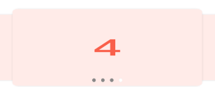

# Android轮播控件
[  ](https://bintray.com/a13706649811/maven/banner/3.1.1-x/link)[  ](https://bintray.com/a13706649811/maven/banner/_latestVersion)

ViewPager无限轮播功能。可以自定义indicator，需自定义实现 **Indicator** 接口，内置了圆形的IndicatorView，支持五种动画切换。
无缝衔接[MagicIndicator](https://github.com/hackware1993/MagicIndicator)大神的Indicator，打造花样Indicator，集成使用请参考Sample。


* 支持自动轮播
* 支持一屏三页
* 支持仿魅族效果
* 支持自定义Indicator
* 支持自定义view
* 支持数据刷新
* 解决下拉刷新等滑动冲突问题，如嵌套SwipeRefreshLayout
* 解决多次重复回调onPageSelected问题
* 解决添加到RecyclerView头部的滑动问题
* 良好的代码封装，更多优化请参考代码实现。

##### [版本更新内容点击查看](https://github.com/zguop/banner/releases)

## 效果图

**点击下载 [banner.apk](https://fir.im/r7le) 体验**

------

|基本使用的功能，请下载apk体验更流畅|
|---|
||

|描述|普通样式|两边缩放|魅族样式|
|---|---|---|---|
|**一屏三页**||||

|IndicatorView|IndicatorStyle|
|---|---|
|INDICATOR_CIRCLE|INDICATOR_CIRCLE_RECT|
|||
|INDICATOR_BEZIER|INDICATOR_DASH|
|||
|INDICATOR_BIG_CIRCLE||
|||

|效果图|1|2|
|---|---|---|
|**收集更多的效果**||
|**Indicator查看simple代码** |||


|切换动画|切换动画|
|---|---|
|||

## 使用步骤

#### Step 1.依赖banner
Gradle 
```groovy
dependencies{
    implementation 'com.to.aboomy:banner:3.1.1'  //最新版本
    implementation 'com.to.aboomy:banner:3.1.1-x' //androidx版本
}
```
或者引用本地lib
```groovy
compile project(':banner')
```


#### Step 2.xml
```xml
    <com.to.aboomy.banner.Banner
        android:id="@+id/banner"
        android:layout_width="match_parent"
        android:layout_height="250dp"/>
```

#### Step 3.自定义HolderCreator
```java
//实现HolderCreator接口
public interface HolderCreator {
    View createView(Context context,final int index, Object o);
}

//举个栗子
public class ImageHolderCreator implements HolderCreator {
    @Override
    public View createView(final Context context, final int index, Object o) {
        ImageView iv = new ImageView(context);
        iv.setScaleType(ImageView.ScaleType.FIT_XY);
        Glide.with(iv).load(o).into(iv);
        //内部实现点击事件
        iv.setOnClickListener(new View.OnClickListener() {
            @Override
            public void onClick(View v) {
                Toast.makeText(context, index + "", Toast.LENGTH_LONG).show();
            }
        });
        return iv;
    }
}
```

#### Step 4.在页面中使用Banner

```java

 @Override
    protected void onCreate(Bundle savedInstanceState) {
        super.onCreate(savedInstanceState);
        setContentView(R.layout.activity_main);
        banner = findViewById(R.id.banner);
        //使用内置Indicator
        IndicatorView qyIndicator = new IndicatorView(this)
              .setIndicatorColor(Color.DKGRAY)
              .setIndicatorSelectorColor(Color.WHITE);
        banner.setIndicator(qyIndicator)
              .setHolderCreator(new ImageHolderCreator())
              .setPages(list);
    }
```

### 简单设置一屏三页效果
```java

//设置左右页面露出来的宽度及item与item之间的宽度
.setPageMargin(UIUtil.dip2px(this, 20), UIUtil.dip2px(this, 10))
//内置ScaleInTransformer，设置切换缩放动画
.setPageTransformer(true, new ScaleInTransformer())
    
```

### 关于ViewPager切换动画

Sample中集成了以下两个ViewPager切换动画，请运行Sample查看动画效果，参考需要的ViewPagerTransform放到项目中，或者根据需求进行自定义。

[ViewPagerTransforms](https://github.com/ToxicBakery/ViewPagerTransforms)

[MagicViewPager](https://github.com/hongyangAndroid/MagicViewPager)

### 如何自定义Indicator
```java
   //实现Indicator接口
/**
 * 可以实现该接口，自定义Indicator 可参考内置的{@link IndicatorView}
 */
public interface Indicator extends ViewPager.OnPageChangeListener {

    /**
     * 当数据初始化完成时调用
     *
     * @param pagerCount pager数量
     */
    void initIndicatorCount(int pagerCount);

    /**
     * 返回一个View，添加到banner中
     */
    View getView();

    /**
     * banner是一个RelativeLayout，设置banner在RelativeLayout中的位置，可以是任何地方
     */
    RelativeLayout.LayoutParams getParams();
}

//举个栗子
public class IndicatorView extends View implements Indicator{
       
        @Override
        public void initIndicatorCount(int pagerCount) {
            this.pagerCount = pagerCount;
            setVisibility(pagerCount > 1 ? VISIBLE : GONE);
            requestLayout();
        }
    
        @Override
        public View getView() {
            return this;
        }
         /**
          * 控制Indicator在Banner中的位置，开发者自行实现
          */
        @Override
        public RelativeLayout.LayoutParams getParams() {
            if (params == null) {
                params = new RelativeLayout.LayoutParams(ViewGroup.LayoutParams.WRAP_CONTENT, ViewGroup.LayoutParams.WRAP_CONTENT);
                params.addRule(RelativeLayout.ALIGN_PARENT_BOTTOM);
                params.addRule(RelativeLayout.CENTER_HORIZONTAL);
                params.bottomMargin = dip2px(10);
            }
            return params;
        }
        /**
          * banner切换时同步回调的三个方法
          */
        @Override
        public void onPageScrolled(int position, float positionOffset, int positionOffsetPixels) {
            selectedPage = position;
            offset = positionOffset;
            invalidate();
        }
        
        @Override
        public void onPageSelected(int position) {
        }
        
        @Override
        public void onPageScrollStateChanged(int state) {
        }
}

```
### Banner提供的方法介绍，banner未提供任何自定义属性

|方法名|描述|
|---|---| 
|setPageTransformer(boolean reverseDrawingOrder, ViewPager.PageTransformer transformer)|设置viewpager的自定义动画|
setOuterPageChangeListener(ViewPager.OnPageChangeListener outerPageChangeListener)|设置viewpager的滑动监听
|setAutoTurningTime(long autoTurningTime)|设置自动轮播时长
|setPagerScrollDuration(int pagerScrollDuration)|设置viewpager的切换时长
|setAutoPlay(boolean autoPlay)|设置是否自动轮播，大于1页可以轮播
|setIndicator(Indicator indicator)|设置indicator
|setIndicator(Indicator indicator, boolean attachToRoot)|设置indicator
|HolderCreator(HolderCreator holderCreator))|设置view创建接口
|setPages(List<?> items)|加载数据，此方法时开始轮播的方法，请再最后调用
|setPages(List<?> items, int startPosition)|重载方法，设置轮播的起始位置
|isAutoPlay()|是否无限轮播
|getCurrentPager()|获取viewPager位置
|startTurning()|开始轮播
|stopTurning()|停止轮播
|setPageMargin(int multiWidth, int pageMargin)|设置一屏多页
|setPageMargin(int leftWidth, int rightWidth, int pageMargin)|设置一屏多页,方法重载
|setOffscreenPageLimit(int limit)|同viewPager用法
|setOnPageClickListener(OnPageItemClickListener onPageClickListener)|扩展接口,设置itemView点击事件，3.1.0新增

### 内置IndicatorView使用方法介绍，没有提供任何自定义属性
|方法名|描述|
|---|---|
|setIndicatorRadius(float indicatorRadius)|设置圆点半径|
|setIndicatorSpacing(float indicatorSpacing)|设置圆点间距|
|setIndicatorStyle(@IndicatorStyle int indicatorStyle)|设置圆点切换动画，内置五种切换动画，请参考Sample|
|setIndicatorColor(@ColorInt int indicatorColor)|设置默认的圆点颜色|
|setIndicatorSelectorColor(@ColorInt int indicatorSelectorColor) |设置选中的圆点颜色|
|setParams(RelativeLayout.LayoutParams params) |设置IndicatorView在banner中的位置，默认底部居中，距离底部10dp，请参考Sample|
|setIndicatorRatio(float indicatorRatio)|设置indicator比例，拉伸圆为矩形，设置越大，拉伸越长，默认1.0，版本3.1.1新增|
|setIndicatorSelectedRadius(float indicatorSelectedRadius)|设置选中的圆角，默认和indicatorRadius值一致，可单独设置选中的点大小，版本3.1.1新增|
|setIndicatorSelectedRatio(float indicatorSelectedRatio)|设置选中圆比例，拉伸圆为矩形，控制该比例，默认比例和indicatorRatio一致，默认值1.0，版本3.1.1新增|
 
### 感谢
项目参考了[banner](https://github.com/youth5201314/banner) count+2的轮播思想。

### 总结
-
xiexie ni de guāng gù ！ 喜欢的朋友轻轻右上角赏个star，您的鼓励会给我持续更新的动力。


