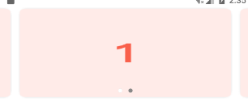
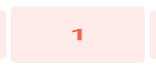
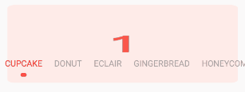

# Android轮播控件
[  ](https://bintray.com/a13706649811/maven/pager2Banner/_latestVersion)

**全新升级**，基于**ViewPager2**实现无限轮播功能。可以自定义indicator，需自定义实现 **Indicator** 接口，内置了的IndicatorView，支持五种动画切换。**支持传入RecyclerView.Adapter 即可实现无限轮播**，支持任何ReyclerView.Apdater框架，集成使用请参考Demo。


* 支持自动轮播
* 支持一屏三页
* 支持自定义Indicator
* 支持自定义view
* 支持垂直滚动
* 支持任意RecyclerView.adapter
* 目前就4个类，良好的代码封装，更多请参考代码实现。


ViewPager2是androidx中的
还在使用support请使用ViewPager版本(持续维护...)[banner请点击](https://github.com/zguop/banner/blob/master/README_pager.md)


## 效果图

**点击下载 [banner.apk](http://d.6short.com/r7le) 体验**

------

|基本使用的功能，请下载apk体验更流畅|
|---|
||

|描述|普通样式|两边缩放|
|---|---|---|
|**一屏三页**|||

|IndicatorView|IndicatorStyle|
|---|---|
|INDICATOR_CIRCLE|INDICATOR_CIRCLE_RECT|
|||
|INDICATOR_BEZIER|INDICATOR_DASH|
|||
|INDICATOR_BIG_CIRCLE||
|||


#### 注意：0.0.5版本开始，IndicatorView更新

* INDICATOR_DASH：不再提供默认的长度，默认是没有长度的，一定要设置setIndicatorSelectedRatio属性，将圆点进行拉伸为矩形。

* INDICATOR_BIG_CIRCLE：不再提供默认的Max圆，默认是一样大的，所以看起来没有效果，一定要设置indicatorSelectedRadius属性，控制选中的大小。

|效果图|1|2|
|---|---|---|
|**收集更多的效果**||
|**Indicator查看simple代码** |||
||||
|||...|


#### [版本更新内容点击查看](https://github.com/zguop/banner/releases)


## 使用步骤

#### Step 1.依赖banner

Gradle 
```groovy
	
dependencies{
    implementation 'com.to.aboomy:pager2banner:1.0.2' //最新版本
}
```
或者引用本地lib
```groovy
compile project(':pager2banner')
```

#### Step 2.xml
```xml
     <com.to.aboomy.pager2banner.Banner
        android:id="@+id/banner"
        android:layout_width="match_parent"
        android:layout_height="150dp"/>
```

#### Step 3.自定义RecyclerView.Adapter

```java
//自定义adapter
public class ImageAdapter extends RecyclerView.Adapter<RecyclerView.ViewHolder> 
 
//或者使用其他三方框架，都是支持的，如：BRVAH
public class ImageAdapter extends BaseQuickAdapter<String, BaseViewHolder> {
    public ImageAdapter() {
        super(R.layout.item_image);
    }
    @Override
    protected void convert(@NonNull BaseViewHolder helper, String item) {
        Glide.with(mContext)
                .load(item)
                .into((ImageView) helper.getView(R.id.img));
    }
}
```

#### Step 4.在页面中使用Banner

```java

 @Override
    protected void onCreate(Bundle savedInstanceState) {
        super.onCreate(savedInstanceState);
        setContentView(R.layout.activity_main);
        banner = findViewById(R.id.banner);
        
        //使用内置Indicator
        IndicatorView indicator = new IndicatorView(this)
              .setIndicatorColor(Color.DKGRAY)
              .setIndicatorSelectorColor(Color.WHITE);
        
        //创建adapter
     	 ImageAdapter adapter = new ImageAdapter();
     	 
     	 //传入RecyclerView.Adapter 即可实现无限轮播
         banner.setIndicator(indicator)
              .setAdapter(adapter);
    }
```

### 简单设置一屏三页效果
```java

//设置左右页面露出来的宽度及item与item之间的宽度
.setPageMargin(UIUtil.dip2px(this, 20), UIUtil.dip2px(this, 10))
//内置ScaleInTransformer，设置切换缩放动画
.setPageTransformer(true, new ScaleInTransformer())
    
```
##### 支持访魅族样式
```java
//单独设置OverlapSliderTransformer，项目里有，可以拷贝到项目中使用 kotlin实现的-。-
 .addPageTransformer(new OverlapSliderTransformer(banner.getViewPager2().getOrientation(), 0.25f, 0, 1,0))

```

### 关于ViewPager切换动画

pager2banner 只内置了 ScaleInTransformer ，这个比较常用。
demo里集成了以下两个ViewPager切换动画，请运行Sample查看动画效果，需要哪个拷贝到项目中用好了。

[ViewPagerTransforms](https://github.com/ToxicBakery/ViewPagerTransforms)

[MagicViewPager](https://github.com/hongyangAndroid/MagicViewPager)

### 介绍一下 IndicatorView
内置的indicator很强大，可以做到很多效果了，很灵活，可以运行demo尝试改变一下参数：

```java
    .setIndicatorRatio(1f) //ratio，默认值是1 ，也就是说默认是圆点，根据这个值，值越大，拉伸越长，就成了矩形，小于1，就变扁了呗
    .setIndicatorRadius(2f) // radius 点的大小
    .setIndicatorSelectedRatio(3) 
    .setIndicatorSelectedRadius(2f)
    .setIndicatorStyle(IndicatorView.IndicatorStyle.INDICATOR_BIG_CIRCLE)       

```

### 如何自定义Indicator
```java
/**
 * 可以实现该接口，自定义Indicator 可参考内置的{@link IndicatorView}
 */
public interface Indicator {

    /**
     * 当数据初始化完成时调用
     *
     * @param pagerCount pager数量
     */
    void initIndicatorCount(int pagerCount);

    /**
     * 返回一个View，添加到banner中
     */
    View getView();

    /**
     * banner是一个RelativeLayout，设置banner在RelativeLayout中的位置，可以是任何地方
     */
    RelativeLayout.LayoutParams getParams();
    
    void onPageScrolled(int position, float positionOffset, @Px int positionOffsetPixels);
    
    void onPageSelected(int position);
    
    void onPageScrollStateChanged(int state);
}

//举个栗子
public class IndicatorView extends View implements Indicator{
       
        @Override
        public void initIndicatorCount(int pagerCount) {
            this.pagerCount = pagerCount;
            setVisibility(pagerCount > 1 ? VISIBLE : GONE);
            requestLayout();
        }
    
        @Override
        public View getView() {
            return this;
        }
         /**
          * 控制Indicator在Banner中的位置，开发者自行实现
          */
        @Override
        public RelativeLayout.LayoutParams getParams() {
            if (params == null) {
                params = new RelativeLayout.LayoutParams(ViewGroup.LayoutParams.WRAP_CONTENT, ViewGroup.LayoutParams.WRAP_CONTENT);
                params.addRule(RelativeLayout.ALIGN_PARENT_BOTTOM);
                params.addRule(RelativeLayout.CENTER_HORIZONTAL);
                params.bottomMargin = dip2px(10);
            }
            return params;
        }
        /**
          * banner切换时同步回调的三个方法
          */
        @Override
        public void onPageScrolled(int position, float positionOffset, int positionOffsetPixels) {
            selectedPage = position;
            offset = positionOffset;
            invalidate();
        }
        
        @Override
        public void onPageSelected(int position) {
        }
        
        @Override
        public void onPageScrollStateChanged(int state) {
        }
}

```
### Banner提供的方法介绍，banner未提供任何自定义属性

|方法名|描述|
|---|---| 
|addPageTransformer(ViewPager2.PageTransformer transformer)|设置viewpager2的自定义动画，支持多个添加
|setOuterPageChangeListener(ViewPager2.OnPageChangeCallback listener)|设置viewpager2的滑动监听
|setAutoTurningTime(long autoTurningTime)|设置自动轮播时长
|setAutoPlay(boolean autoPlay)|设置是否自动轮播，大于1页可以轮播
|setIndicator(Indicator indicator)|设置indicator
|setIndicator(Indicator indicator, boolean attachToRoot)|设置indicator
|setAdapter(@Nullable RecyclerView.Adapter adapter)|加载数据，此方法时开始轮播的方法，请再最后调用
|setAdapter(@Nullable RecyclerView.Adapter adapter, int startPosition)|重载方法，设置轮播的起始位置
|isAutoPlay()|是否无限轮播
|getCurrentPager()|获取viewPager2当前位置
|startTurning()|开始轮播
|stopTurning()|停止轮播
|setPageMargin(int multiWidth, int pageMargin)|设置一屏多页
|setPageMargin(int leftWidth, int rightWidth, int pageMargin)|设置一屏多页,方法重载
|setOffscreenPageLimit(int limit)|同viewPager2用法
|setOrientation(@ViewPager2.Orientation int orientation)|设置viewpager2滑动方向|
|ViewPager2 getViewPager2()|获取viewpager2|
|RecyclerView.Adapter getAdapter()|获取apdater|
|setPagerScrollDuration(long pagerScrollDuration)|设置viewpager2的切换时长|

### 内置IndicatorView使用方法介绍，没有提供任何自定义属性
|方法名|描述|
|---|---|
|setIndicatorRadius(float indicatorRadius)|设置圆点半径|
|setIndicatorSpacing(float indicatorSpacing)|设置圆点间距|
|setIndicatorStyle(@IndicatorStyle int indicatorStyle)|设置圆点切换动画，内置五种切换动画，请参考Sample|
|setIndicatorColor(@ColorInt int indicatorColor)|设置默认的圆点颜色|
|setIndicatorSelectorColor(@ColorInt int indicatorSelectorColor) |设置选中的圆点颜色|
|setParams(RelativeLayout.LayoutParams params) |设置IndicatorView在banner中的位置，默认底部居中，距离底部10dp，请参考Sample|
|setIndicatorRatio(float indicatorRatio)|设置indicator比例，拉伸圆为矩形，设置越大，拉伸越长，默认1.0|
|setIndicatorSelectedRadius(float indicatorSelectedRadius)|设置选中的圆角，默认和indicatorRadius值一致，可单独设置选中的点大小|
|setIndicatorSelectedRatio(float indicatorSelectedRatio)|设置选中圆比例，拉伸圆为矩形，控制该比例，默认比例和indicatorRatio一致，默认值1.0|

### 总结
-
xiexie ni de guāng gù ！ 喜欢的朋友轻轻右上角赏个star，您的鼓励会给我持续更新的动力。


